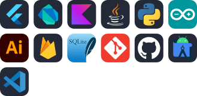

<!-- ===================================================== -->
<!-- 🚀 AKSHAI KRISHNA A — CREATIVE SOFTWARE ENGINEER 🚀 -->
<!-- ===================================================== -->

<p align="center">
  
</p>

<!-- ===================== GREETING ===================== -->
<p align="center">
  
</p>

<p align="center">
  
</p>

<!-- ===================== NAVIGATION BUTTONS ===================== -->
<p align="center">
  <a href="https://www.linkedin.com/in/akshai-krishna-a-a5ab99224">
    
  </a>
  <a href="https://github.com/Akshai-krishna-2003">
    
  </a>
  <a href="https://leetcode.com/u/Akshay2036/">
    
  </a>
  <a href="https://akshai-krishna-2003.netlify.app/">
    
  </a>
</p>

<!-- ===================== PROFILE METRICS ===================== -->
<p align="center">
  
  
</p>

---

## 🧠 WHO I AM  
<div align="center">
<pre>
'''
                #%%%@%########***#########****#####                            
          #####%%%%%####**### ***********##*****######*                        
        ###############**###***+++++*++++**********######                      
      +############******##*+++++++++++++++*********#######*                   
    ++######*****#****#****+++++++++++++++***********##******##                
   +**####**********+*****+++++++++**++++++***+***************##*              
   **####********+++**#*+++++++++++++++++*****#*++***#**********###            
  ***####******++++++++++++====+++++++++++++++++++********##********           
  *#####***+++++++++++++=++====+++****+*+++++++***+****++***#******####        
   #####***+++++++++++========+++++++***+**++++*+++***++*************##        
    ####***++++++++++========++++++++++++++++++++++***+******+++++****#*       
    *##*#*++++++++++===========+++++++=+++++++++++*+++***#**+++++++***##*      
    *##**+++++++++++======================++==++***+++++****+++++++****#**     
     ##**+++++++=+++++=======++++++++=======+++++++*++++***+++++++++******     
     +**+++++++==+++++++++++++++++++++++====++++=++++++++*#*++++++++*****#*    
    #****++++++++++++++++++++++++++++++++++++++=++++++++****++++++++++***#*    
  **#+***++++++++++**+++*+++*********+++++++++++++++++++++**+++++++++*****#*** 
+*####***+++++++++********##%%%@@%%###******++++++++++++++***+++++++++****##*  
 *###***+++++++++*****##%%%%@@@@@@@@@@@@@@@%***+++++++++++**+++++++++++****####
 *####**+++++++++****##%%@@@@@@@@@@@@@@@@@@@@@%#*#***+++++++*+***#*********#%##
  #####***++++++***###%%@@@@@@@@@@@@@@@@@@@@@@@@@%%#***++++++++++++++*******###
   ##%%#**+++++******##%@@@@@@@@@@@@@@@@@@@@@@@@@@@@@@@%*+++++++++***********##
    #####**++++**++++***#%@@@@@@@@@@@@@@@@@@@@@@@@@@@@@@@#++++***#**********###
     ####***++**++++++++***#%@@@@@@@@%%#######%%%@@@@@@@@%****++++*+++******###
         *#***#*****#**++++**#%@@@@%***********####%@@@@@@#***++***++++++***###
          *#####****++++++++**%@@@@@@%#**#%%@@@@@@@@%@@@@@%*++++++++++++****###
           *###*****#***+#*++*@@@@@@@#******###%@@@@@@@@@@@*+++++++++++***##%##
           #%##*****####%#*+*#@@@@@@@@*##@****#****%@@@@@@@@*+++++++++++***### 
            %##%%#***#####***#@@@@@@@@%**#%@@@@@@@@@@@@@@@@@%*++++********###  
            %%%@@@@@%%@@@%**#%@@@@@@@@@@%%%%@@@@@@@@@@@@@@@@@#***####%#*####   
            %%%@@@@@@@@@@#*#@@@@@@@@@@@@@@@@@@@@@@@@@@@@@@@@@#*#@@@@@@#**#     
            %%@@@@@@@@@@**%@@@@@@@@@@@@@@@@@@@@@@@@@@@@@@@@@%##%@@@@@@#        
            %%%@@@@@@@%***%@@@@@@@@@@@@@@@@@@@@@@@@@@@@@@@@@%#%@@@@@@%         
            %%%@@@@@@#****#@@@@@@@@@@@@@@@@@@@@@@@@@@@@@@@@@##%@@@@@@#         
            %##%%@@%*****++*%%%#***#@@@@@@@@@@@@@@@@@@@@@@@%#*#@@@@@@          
           #%###%%#***++++++*#%###%@@@@@@@@@@@@@@@@@@@@@@@@###@@@@@@           
           ######*****++****#%###****###%@@@@@@@@@@@@@@@@@%##%@@@@%            
            ####***********##%@@@@%###***#%@@@@@@@@@@@@@%%####%#%              
            ##******##***%@@@@@@@@@@@%*+****#%@@@@@@@@%%%%####*                
             *************%@@@@@@@@@@@@@#****#@@@@@%%%#%%#**##                 
             **************#%%%@@@@@@@@@@***##%@@@@%%%%##***#*                 
              *******************#@@@@@@%***%%##%%%%%%##*******#               
              +***+++*********##%@@@%%%##***%%########****#*+++*%%             
                **+++++********###%%##******###******++**%%#++#%%%             
                 **+++++**********###*#+*+*******+++++**%@#**#%%%%             
                  *+++++++*******#*****+++*++++++++++*%@#**####%%%             
                +*+++++++++**++******++++++++++++++*#@%***####%%%@@            
               **+++++++++++++++***++++++++++++++*%@%*+*#######%@@%%           
               *++++===+=====++=++++++++++++++*#@@%*+**#######@@@%####         
              +*+++===================++++*%%@@@#++**#######@@@####*####%      
              *+++=======++++++++++++*#%%%%@@%*+++**######%@%#**###*#####%%  
```
  </pre>
</div>
<p align="center">
  
</p>

```java
public final class AkshaiKrishnaA {

    // Identity
    private static final String NAME = "Akshai Krishna A";
    private static final String ROLE = "Software Engineer | Mobile Engineer";

    // Language & stack evolution
    private static final String FOUNDATION_LANGUAGE = "Python";
    private static final String CURRENT_STACK = "Dart (Flutter)";
    private static final boolean ADAPTABLE = true; // fast context switching

    // Programming language proficiency
    private static final List<String> STRONG_LANGUAGES = List.of(
        "Java",
        "Python",
        "Dart"
    );

    private static final List<String> WORKING_KNOWLEDGE = List.of(
        "C",
        "C++",
        "JavaScript"
    );

    // Engineering mindset
    private static final List<String> CORE_TRAITS = List.of(
        "product-minded engineer",
        "offline-first architecture specialist",
        "enterprise systems builder",
        "AI-integrated mobile developer"
    );

    // Hands-on experience
    private static final Map<String, List<String>> EXPERIENCE = Map.of(
        "Enterprise Systems", List.of("SAP Business One", "IBM Maximo"),
        "Mobile Development", List.of("Flutter", "Android", "Jetpack Compose"),
        "Backend & Data", List.of("REST APIs", "Firebase", "SQLite"),
        "AI / ML", List.of("prediction models", "LLM integrations"),
        "IoT", List.of("Arduino-based systems")
    );

    // Engineering philosophy
    public static String philosophy() {
        return "If it doesn't scale, it doesn't ship.";
    }
}
```
<br />


---


## 🛠 TECH DNA

<p align="center">
  
</p>

<p align="center">
  
</p>

<br />

---

## 🚀 PROJECTS

<p align="center">
  
</p>

<table align="center">
<tr>
<td width="50%" valign="top">

### 📡 Signal Mapper  
<sub><span style="color:#38BDF8">Android · Network Intelligence</span></sub>

<p>
  
  
</p>

<p>
  
  
  
</p>

<p style="color:#CBD5E1">
Real-time cellular & Wi-Fi signal mapping with
ML-assisted connectivity prediction.
</p>

🔗 <a href="https://github.com/Akshai-krishna-2003/Signal-Mapper">View Repository →</a>

</td>

<td width="50%" valign="top">

### 🌟 AstroConnect  
<sub><span style="color:#A78BFA">Flutter · AI-Driven App</span></sub>

<p>
  
  
</p>

<p>
  
  
  
</p>

<p style="color:#CBD5E1">
AI-powered astrology & compatibility app
built for scale and low-latency.
</p>

📱 <a href="https://play.google.com/store/apps/details?id=com.AstroApp.astro_app">
Play Store →
</a>

</td>
</tr>
</table>

<br/>

---

## 📈 GITHUB ACTIVITY 
<p align="center">
  
</p>

<!-- ===================== PRIMARY PROOF ===================== -->
<p align="center">
  
</p>


<!-- ===================== CONSISTENCY ===================== -->
<!-- <p align="center">
  
</p> -->


<!-- ===================== VELOCITY ===================== -->
<p align="center">
  
</p>

<div align="center">


</div>

<br/>


---

<!-- Animated footer wave -->
<p align="center">
  
</p>

<!-- Contact buttons -->
<p align="center">
  <a href="mailto:akshaykrishna1983@gmail.com">
    
  </a>
  <a href="https://akshai-krishna-2003.netlify.app/">
    
  </a>
</p>

<h3 align="center" style="color:#38BDF8">
⚡ I LOVE TO CODE. ⚡
</h3>
